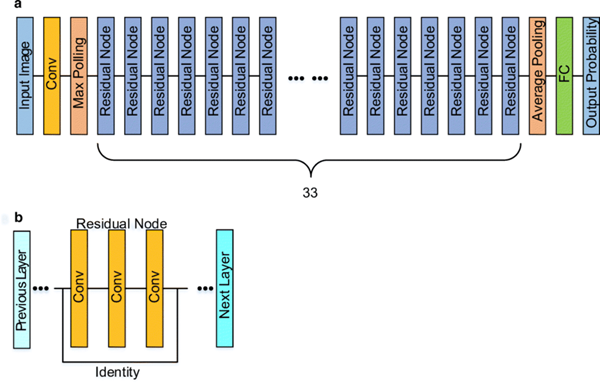
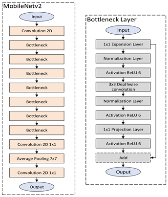
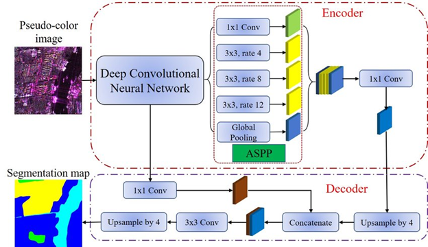
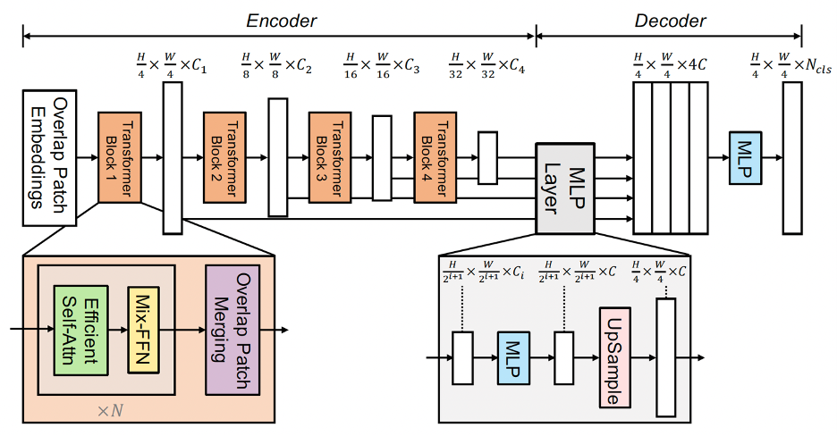
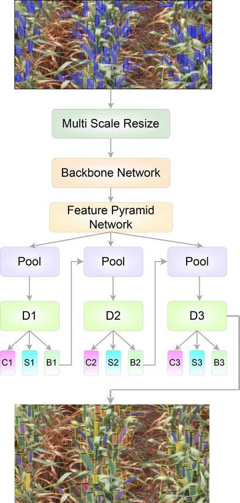
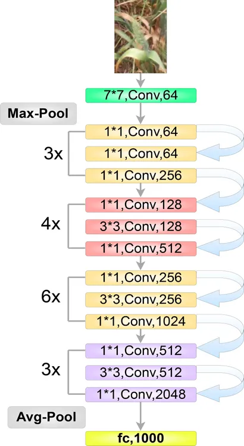
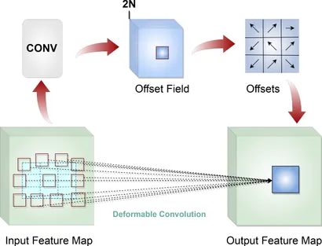

# Literature Review on Segmentation Models used on Crops

- [Literature Review on Segmentation Models used on Crops](#literature-review-on-segmentation-models-used-on-crops)
  - [Gustavo](#gustavo)
    - [Mask-RCNN + ResNet101](#mask-rcnn--resnet101)
    - [MobileNetv2 + DeepLabv3+](#mobilenetv2--deeplabv3)
  - [Jorge](#jorge)
    - [SegFormer](#segformer)
  - [Vlasis](#vlasis)
    - [ResNet50 + DCN (Deformable Convolution Network) + Cascade Mask R-CNN](#resnet50--dcn-deformable-convolution-network--cascade-mask-r-cnn)

## Gustavo

### Mask-RCNN + ResNet101

**Papers Links:** [Paddy Rice](https://www.mdpi.com/2073-4395/11/8/1542). Original Publications: [Mask R-CNN](https://arxiv.org/abs/1703.06870). [ResNet](https://arxiv.org/abs/1512.03385).

**Objective Organ:** Rice Spikelet's.

**The model architecture short description:**

* ResNet-101: It is also known as the Residual Network, and the main innovation was the skip connections, which help training models by solving the vanishing gradient problem. As the name says, it has 101 layers, structured in stages of residual blocks. It has an initial layer of a Convolution and a MaxPool. Then, it uses Bottleneck blocks, having 3 convolutions and skip connections, adding the input to the output of the block. Lastly, it has an AvgPool, a Fully Connected Layer, and the output. 

* At its end, it employs a Feature Pyramid Network (FPN), which handles objects at multiple scales. FPN creates a pyramid of feature maps at different resolutions. 

* After having the features extracted from the ResNet-101 + FPN, the data goes to a Region Proposal Network (RPN), which proposes regions of interest (RoIs) where objects might be located. It outputs: i) bounding box proposals, and ii) probability of being object or background). 

* The output from the ResNet-101 and from RPN goes to a RoIs alignment, which avoids quantization issues and preserves spatial alignment. This alignment extracts fixed-size feature maps for each proposed region. 

* Each RoI is processed in parallel by three branches: 

  * Classification Head: It classifies the object in the RoI. 

  * Bounding Box Regression Head: It refines the coordinates of the bounding box. For the classifications and the bounding box, it uses fully connected layers. 

  * Mask Head: It has a small Fully Convolutional Network (FCN) that predicts a binary mask for each class. It outputs a pixel-wise segmentation mask for the object.

**Results Obtained:** The authors used the combination of Mask-RCNN and ResNet101 as a backbone to create a refined dataset for ground-truth labels.

### MobileNetv2 + DeepLabv3+

**Papers Links:** [Lettuce Traits](https://link.springer.com/article/10.1007/s11694-022-01660-3). Original Publications: [DeepLabv3+](https://arxiv.org/abs/1802.02611). [MobileNetv2](https://arxiv.org/abs/1801.04381).

**Objective Organ:** Lettuce Leaf.

**The model architecture short description:**

* MobileNetv2 is a lightweight model designed for mobile and embedded vision applications. It is built around two key ideas:
  * Inverted Residuals and
  * Linear Bottlenecks
* It has a simple convolutional layer, 7 inverted residual blocks, a 1x1 convolutional layer, a 7x7 average pooling, and finally a 1x1 convolutional layer.
* The Inverted Residual Blocks consists of:
  *   A 1x1 convolutional expansion layer to expand the number of channels. Followed by a normalization layer and a RELU activation layer.
  * A 3x3 Depthwise convolution that applies convolution to each channel separately. Followed by a normalization layer and a RELU activation layer.
  * A 1x1 Projection Layer to reduce the number of channels back to a smaller size. Followed by a RELU activation layer.
  * Lastly, a residual connection between the first 1x1 convolutional layer to the last RELU activation layer.

* DeepLabv3+ is built upon DeepLabv3 by adding a decoder module that refines the segmentation results. It combines atrous convolutions, spatial pyramid pooling, and an encoder-decoder structure.
* The backbone (in this case, MobileNetv2) extracts the feature maps from the image.
* The encoder uses this feature map into a Atrous Spatial Pyramid Pooling (ASPP), which captures multi-scale context using parallel atrous convolutions with different dilation rates. It has:
  * 1x1 convolution.
  * 3x3 atrous convolutions with rates like 4, 8, 12.
  * Global pooling.
  * All the outputs are concatenated and passed through another 1x1 convolution
* The decoder module is used to refine the segmentation map, especially around object boundaries. It:
  * Upsamples the ASSP output to match the Backbone output.
  * Concatenate with the Backbone output.
  * Goes through a 3x3 convolutional layer and finally upsamples to the original image size.

**Results Obtained:** Pixel Accuracy of 99%, higher than other high-level models.

## Jorge

### SegFormer

**Papers Links:** [Wheat Full Semantic Organ Segmentation](https://www.sciencedirect.com/science/article/pii/S2643651525000901?via%3Dihub). Original Publication: [SegFormer](https://arxiv.org/abs/2105.15203).

**Objective Organ:** Wheat Spike

**The model architecture short description:**

* SegFormer is a transformer-based model for semantic segmentation. It unifies transformers with lightweight multilayer perceptron (MLP) decoders. It redesign both encoder and decoder. The key innovations of this work are:
  * A novel positional-encoding free and hierarchical transformer encoder.
  * A lightweight A11-MLP decoder design.

* The workflow is as follows: Given an input image of size H * W *3 the image is divided into overlapping patches of  4 * 4 pixels, resulting in a total of  H/4 * W/4  patches. These patches are then fed into a hierarchical Transformer encoder, which produces multi-level feature maps at different scales (1/4, 1/8, 1/16, and 1/32 of the original resolution). At each stage, the spatial resolution decreases while the channel dimension  C increases, enabling the model to capture both fine-grained details and high-level semantic features.

  * **Shallow Layers:** Fine, detailed features. (Transformer Block 1)
  * **Deep Layers:** Coarse, global features (Transformer Block 4)

* SegFormer grab all this features of all the stages (4). Pass them through MLPs to unify their channel dimensions and upscale lower-resolution features to match the highest resolution  H/4 * W/4 . Then it concatenate (fuse) all features and another MLP processes this fused feature map, in order to predict the original segmentation mask H/4 * W/4.

**Results Obtained:** In wheat, Segformer model performed slightly better than DeepLabV3Plus with a mIOU for leaves and spikes of ca. 90 %. However, the precision for stems with 54 % was rather lower.

## Vlasis

### ResNet50 + DCN (Deformable Convolution Network) + Cascade Mask R-CNN

**Papers Links:** [WheatSpikeNet](https://www.frontiersin.org/journals/plant-science/articles/10.3389/fpls.2023.1226190/full). Original Publications: [Cascade Mask R-CNN](https://ieeexplore.ieee.org/abstract/document/8917599/), [ResNet](https://arxiv.org/abs/1512.03385), [DCN](https://arxiv.org/abs/1703.06211v3)

**The model architecture short description:**

* ResNet-50 Backbone with Deformable Convolutional Networks (DCN): Enables filters to adapt spatially to irregular shapes and orientations of wheat spikes.
* Feature Pyramid with Generic RoI Extractor (GRoIE): Aggregates multi-scale feature information for more accurate region proposals.
* Side-Aware Boundary Localization (SABL): Improves bounding box prediction by regressing the positions of each side (top, bottom, left, right) independently.
* Cascade Structure: Multiple detection heads refine predictions progressively across three stages.

* **Backbone (ResNet-50 + DCN):**
The backbone acts as the feature extractor of the network. ResNet-50, a deep residual network, reliably captures diverse patterns, while the Deformable Convolutional Network (DCN) allows spatial flexibility, helping the model adapt its kernels to the unique characteristics of wheat spikes in various orientations and scales.

* **Feature Pyramid Network (FPN) + Balanced Feature Pyramid (BFP):**
This module generates multi-scale feature representations, with FPN extracting features at different resolutions to detect both small and large spikes, and BFP ensuring balanced fusion of these scales for consistent spatial detail throughout the image.

* **Generic RoI Extractor (GRoIE):**
GRoIE pools region features from all levels of the FPN, using attention mechanisms and non-local operations to ensure each detected region includes a rich variety of contextual and fine-grained information. This is essential for segmenting spikes that are partially hidden or closely packed.

* **Region Proposal Network (RPN):**
The RPN generates candidate bounding boxes (“proposals”) where objects (spikes) may be located, scoring them for likelihood and refining their coordinates. This step forms the foundation for subsequent detection and segmentation.

* **Side Aware Boundary Localization (SABL):**
SABL enhances box localization by predicting each side of the bounding box independently, which allows for more precise object boundaries—especially important for the irregular shapes and contours of wheat spikes

* **Mask Head:**
Each cascade stage includes a fully convolutional Mask Head, which creates a pixel-wise segmentation mask for every detected wheat spike. Multiple such mask predictions from cascade stages are ensembled at inference, increasing robustness and accuracy for complex backgrounds and occlusions.

* **Auto-scaling Learning Rate (LR):**
The learning rate during model training is automatically scaled based on batch size: larger batches use higher LR, smaller batches use lower LR. This ensures stable convergence across a range of hardware setups or memory constraints, making the model practical for large agricultural datasets.

**Results Obtained:** The model outperforms previous methods, with up to +3.46% improved segmentation accuracy over other state-of-the-art models based on Mask R-CNN, RetinaNet, and Hybrid Task Cascade architectures.
